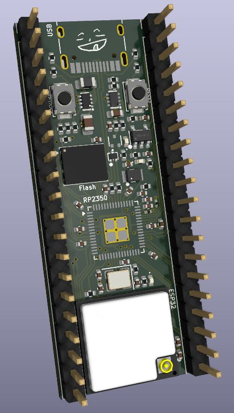

<h1 align="center">
  Noctra Devboard
   
</h1>

<h4 align="center">
A RP2350 based devboard with esp c6 mini integration for wifi + bluetooth.
</h4>
 

| Front Render                            | PCB                    |
| --------------------------------------- | ---------------------- |
|  |  |

<h2>Overview</h2>
- A main MCU (RP2350) for input / output pins
- A coprocessor (ESP32-C6 Mini) for wireless connectivity
- Power management (USB + battery support with battery charging)

<h3>Hardware Specs</h3>
- RP2350 microcontroller
- ESP32-C6 Mini (Wi-Fi + Bluetooth via ESP-AT)
- External 16MB flash memory (128Mbit)
- Power System
  - TPS63100 buck-boost converter: 2A, 1.6V – 5.5V, 3V3_EN pin
  - TPS2116 power mux: Auto-switch between USB and battery (~3V threshold)
  - HX4054A battery charger: 500mA + indicator LED
- USB-C, with TPD2EUSB30 ESD protection for data lines
- ADC filtering + ADC_VREF pin

<h2>How to Use</h2>
Like a normal Pico:
1. Power the board via USB-C, while holding down BOOTSEL to enter firmware writing mode.
2. Flash firmware by dragging in the firmware file.
3. Use onboard GPIO headers as you would with a standard Pico, but with wifi connectivity.

<h3>Motivation</h3>
After making my previous devboard, I wanted something with WiFi + bluetooth, so I came up with this new board. It has everything the previous board has, but better, with better power management, battery charging, and everything I could possibly want.

<h2>Firmware</h2>
Current firmware is untested, but we should be able to use the Challenger+ firmware as the topology and pins are the same. You can find the firmware in the firmware folder.
